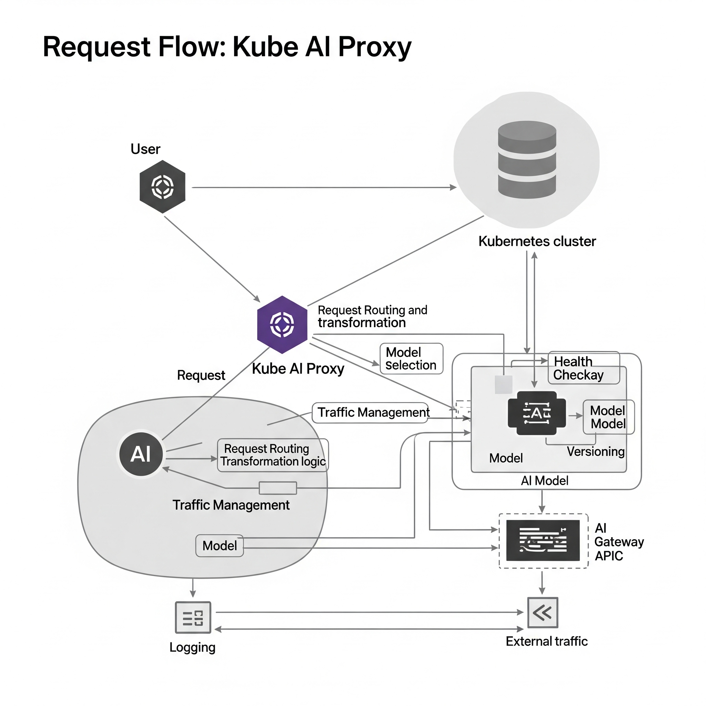

# Kube AI Proxy (kube-ai-proxy)

A Kubernetes Multi-Command Proxy (MCP) Server
Bridging Anthropic’s Claude / FastMCP and your local Kubernetes CLI tools (kubectl, Helm, Istioctl, ArgoCD) via JSON-RPC.

---

<p align="center">
  
</p>

---

## Table of Contents

1. [Project Overview](#project-overview)
2. [Key Features](#key-features)
3. [Architecture & Workflow](#architecture--workflow)
4. [Technology Stack](#technology-stack)
5. [Getting Started](#getting-started)

   * [Prerequisites](#prerequisites)
   * [Local Development](#local-development)
   * [Docker Build & Run](#docker-build--run)
6. [Using with Claude Desktop](#using-with-claude-desktop)
7. [Example End-to-End Demo](#example-end-to-end-demo)
8. [Contributing](#contributing)
9. [License](#license)
10. [Contact](#contact)

---

## Project Overview

`kube-ai-proxy` is an MCP server that wraps popular Kubernetes CLIs behind a secure, standardized JSON-RPC interface.

* Why?

  * Expose `kubectl`, `helm`, `istioctl`, and `argocd` commands to AI assistants (Claude, ChatGPT) without giving them shell access.
  * Enforce command validation, RBAC checks, timeouts, and structured results.
  * Simplify integration into AI-driven DevOps workflows (e.g., ChatOps).

---

## Key Features

* JSON-RPC Interface
  Exposes `describe_<tool>` and `execute_<tool>` methods for help text & command execution.
* Security & Validation

  * Command syntax validation (allowed CLIs + Unix utilities).
  * Optional RBAC “pre-flight” checks against a kubeconfig.
* Async & Parallel Execution
  Powered by Python 3.13’s `asyncio` and FastMCP for high throughput.
* Docker-First Deployment
  Multi-stage Dockerfile with platform-specific downloads of `kubectl`, `helm`, etc.
* Claude / Anthropic Integration
  Ready-made `config.json` for Claude Desktop’s “Custom AI” config.

---

## Architecture & Workflow

1. Claude sends a JSON-RPC request to `kube-ai-proxy` (stdin/stdout or SSE).
2. FastMCP server parses request, runs “before” middleware (validation, RBAC).
3. Executor modules (`kubectl.py`, `helm.py`, etc.) run the CLI via `asyncio.create_subprocess_exec`.
4. Results (stdout, exit code, errors) are marshalled into JSON and returned to Claude.


---

## Technology Stack

* Language: Python ≥ 3.10 (asyncio, Pydantic)
* MCP Framework: [FastMCP](https://pypi.org/project/fastmcp)
* Docker: Multi-stage build (platform images for `kubectl`, `helm`, `istioctl`, `argocd`)
* JSON-RPC: Standard v2.0 protocol
* Security: CLI command whitelisting, optional RBAC Checker

---

## Getting Started

### Prerequisites

* Python 3.10+
* Docker (for containerized testing)
* A valid Kubernetes context at `~/.kube/config`

### Local Development

1. Clone & install

   ```bash
   git clone https://github.com/your-org/kube-ai-proxy.git
   cd kube-ai-proxy
   python3 -m venv .venv && source .venv/bin/activate
   pip install -e .
   ```
2. Run

   ```bash
   python -m kube_ai_proxy.main
   ```
3. Test via stdin/stdout

   ```bash
   echo '{"jsonrpc":"2.0","id":1,"method":"initialize","params":{"protocolVersion":"1.0","clientInfo":{"name":"cli","version":"1.0"},"capabilities":{}}}' \
     | python -m kube_ai_proxy.main
   ```

### Docker Build & Run

```bash
# Build your image (tag as my-kube-ai-proxy)
docker build -t my-kube-ai-proxy:latest .

# Run interactively, mounting kubeconfig
docker run --rm -i \
  -v ~/.kube:/home/appuser/.kube:ro \
  -e K8S_MCP_TRANSPORT=stdio \
  my-kube-ai-proxy:latest
```

---

## Using with Claude Desktop

1. Install Claude Desktop and go to Custom AI or Advanced settings.

2. Paste this snippet into `config.json`:

   ```jsonc
   {
     "mcpServers": {
       "kubernetes": {
         "command": "docker",
         "args": [
           "run",
           "-i",
           "--rm",
           "-v",
           "~/.kube:/home/appuser/.kube:ro",
           "-e",
           "K8S_MCP_TRANSPORT=stdio",
           "my-kube-ai-proxy:latest"
         ]
       }
     }
   }
   ```

3. In the chat prompt, use JSON-RPC calls:

   ```json
   // Ping
   {"jsonrpc":"2.0","id":1,"method":"ping","params":{}}

   // Describe kubectl help
   {"jsonrpc":"2.0","id":2,"method":"tools/call","params":{"name":"describe_kubectl","argument":{"command":"--help"}}}
   ```

---

## Example End-to-End Demo

### Session 1: Deploy WordPress & Break MariaDB

```bash
// Create namespace
kubectl create namespace claude-demo

// Deploy WordPress with Helm
helm repo add bitnami https://charts.bitnami.com/bitnami
helm install wp bitnami/wordpress \
  --namespace claude-demo \
  --set mariadb.architecture=standalone

// Scale MariaDB down (break)
kubectl scale statefulset wp-mariadb \
  --namespace claude-demo --replicas=0
```

### Session 2: Troubleshoot & Fix

```bash
// Check pods & events
kubectl get pods -n claude-demo
kubectl describe pod wp-...

// Scale MariaDB back up
kubectl scale statefulset wp-mariadb \
  --namespace claude-demo --replicas=1

// Expose via Ingress
kubectl apply -f ingress.yaml -n claude-demo
```

*In Claude Desktop, issue the same via JSON-RPC calls and watch the responses.*

---

## Contributing

1. Fork the repo
2. Create a feature branch `git checkout -b feature/awesome`
3. Commit your changes & tests
4. Open a Pull Request

Please follow the [Python linting & formatting guides](./.github/CONTRIBUTING.md).

---

## License

This project is licensed under the [MIT License](./LICENSE).

---

## Contact

Sai Lohith Motupalli
📧 [sailohith1439@gmail.com](mailto:sailohith1439@gmail.com)


