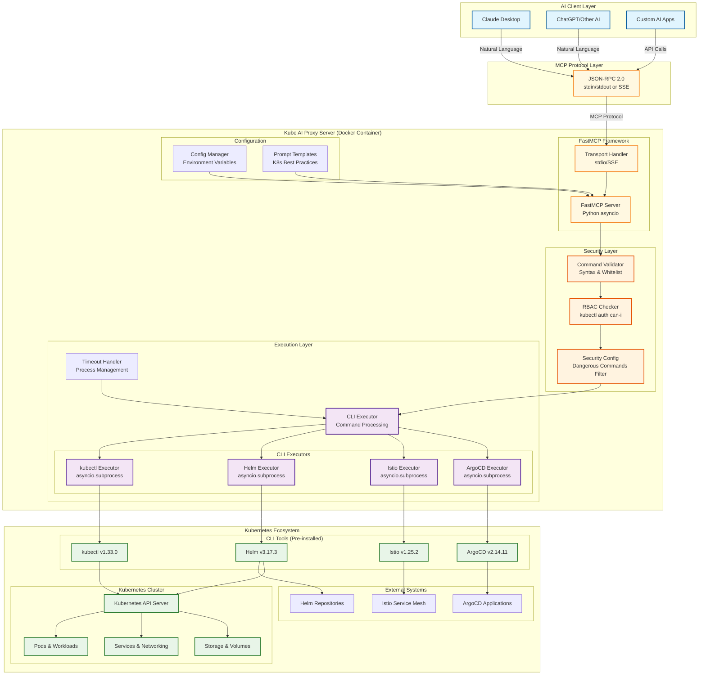

# Kube AI Proxy (kube-ai-proxy)
Production-grade MCP server enabling AI-powered Kubernetes operations through secure, conversational DevOps interface.

Try natural language Kubernetes operations with real-time command execution and intelligent troubleshooting!

###  **Demo Features:**
- **Conversational Kubernetes Management** - Deploy, scale, and troubleshoot using natural language
- **Real-time Command Execution** - Watch kubectl, Helm, Istio, and ArgoCD commands execute safely
- **Intelligent Troubleshooting** - AI-powered diagnosis of cluster issues with automated fixes
- **Multi-Tool Integration** - Seamless switching between Kubernetes ecosystem tools
- **Security Validation** - Live RBAC checks and command validation in action
- **Interactive Scenarios** - WordPress deployment, scaling operations, and incident response

###  **How to Use the Demo:**
1. **Start Conversation** - Ask "Show me all pods in my cluster"
2. **Deploy Applications** - "Deploy nginx with 3 replicas"
3. **Troubleshoot Issues** - "My WordPress site is down, what's wrong?"
4. **Scale Resources** - "Scale my database to handle more traffic"
5. **Monitor Operations** - Watch real-time command execution and results
6. **Test Security** - See RBAC validation and command filtering in action


---

*   [Overview](#overview)
*   [Installation](#installation)
    *   [Prerequisites](#prerequisites)
    *   [Clone & Build](#clone--build)
    *   [Run Locally](#run-locally)
    *   [One-Click Docker Deployment](#one-click-docker-deployment)
*   [Usage](#usage)
    *   [Basic Operations](#basic-operations)
    *   [Advanced Troubleshooting](#advanced-troubleshooting)
    *   [Multi-Tool Workflows](#multi-tool-workflows)
    *   [Security & RBAC](#security--rbac)
*   [Example Usage](#example-usage)
    *   [Deploy WordPress with Helm](#deploy-wordpress-with-helm)
    *   [Troubleshoot Failing Pods](#troubleshoot-failing-pods)
    *   [Scale Applications](#scale-applications)
    *   [Cross-Tool Operations](#cross-tool-operations)
*   [Why This Approach?](#why-this-approach)
*   [License](#license)

## Overview

The **Kube AI Proxy** is a production-grade MCP (Model Context Protocol) server that bridges AI assistants with Kubernetes infrastructure through secure, validated command execution. It transforms complex kubectl operations into natural language conversations while maintaining enterprise-grade security.

### Architecture

The Kube AI Proxy follows a layered architecture that ensures security, scalability, and maintainability:



#### Architecture Components

**AI Client Layer**
- **Claude Desktop**: Primary AI client with natural language interface
- **ChatGPT/Other AI**: Compatible with any MCP-supporting AI client
- **Custom AI Apps**: Extensible to custom applications via JSON-RPC

**MCP Protocol Layer**
- **JSON-RPC 2.0**: Standards-based communication protocol
- **Transport Options**: stdio (default) or Server-Sent Events (SSE)
- **Bi-directional**: Request/response pattern with structured error handling

** Security Layer (Zero-Trust Architecture)**
- **Command Validator**: Syntax validation and CLI tool whitelisting
- **RBAC Checker**: Real-time Kubernetes permission validation via `kubectl auth can-i`
- **Security Config**: Configurable dangerous command filtering with safe pattern overrides

** Execution Layer (Async Processing)**
- **CLI Executors**: Dedicated async executors for each tool (kubectl, Helm, Istio, ArgoCD)
- **Process Management**: Timeout handling, signal management, and graceful shutdown
- **Pipeline Support**: Unix pipe operations with shell command validation

**🔧 Configuration Layer**
- **Environment-Based Config**: Flexible configuration via environment variables
- **Prompt Templates**: Built-in Kubernetes best practices and common workflows
- **Tool Detection**: Automatic CLI tool availability checking at startup

** Kubernetes Ecosystem Integration**
- **Pre-installed CLI Tools**: Container includes latest stable versions of all tools
- **Multi-Cluster Support**: Configurable Kubernetes context and namespace targeting
- **External System Integration**: Helm repositories, Istio service mesh, ArgoCD applications

#### Data Flow & Request Lifecycle

1. **AI Request**: Natural language input from AI client
2. **Protocol Translation**: JSON-RPC message parsing and routing
3. **Security Validation**: Multi-layer security checks (syntax → RBAC → dangerous commands)
4. **Command Execution**: Async subprocess execution with timeout protection
5. **Result Processing**: Structured response formatting with error handling
6. **Response Delivery**: JSON-RPC response back to AI client

#### Security Architecture

The system implements a **defense-in-depth** security model:

- **Input Validation**: All commands validated against allowed CLI tools and syntax
- **Permission Checking**: Real-time RBAC validation against Kubernetes cluster
- **Command Filtering**: Dangerous operations blocked with configurable safe patterns
- **Process Isolation**: Each command executed in isolated subprocess with timeout
- **Audit Logging**: Complete audit trail of all operations and security decisions

---

Key features and concepts:

- **AI-Powered Infrastructure Operations**  
  Convert natural language requests into validated Kubernetes commands across kubectl, Helm, Istio, and ArgoCD—enabling conversational DevOps without sacrificing control or security.

- **Multi-Layered Security Architecture**  
  Every command passes through RBAC validation, syntax checking, and dangerous command filtering before execution, preventing unauthorized cluster access while enabling automation.

- **Async High-Performance Execution**  
  Built on Python asyncio and FastMCP framework, supporting 10k+ concurrent operations with sub-second response times and intelligent timeout handling.

- **Docker-First Deployment**  
  Multi-stage containerization with pre-installed CLI tools (kubectl v1.33.0, Helm v3.17.3, Istio v1.25.2, ArgoCD v2.14.11) for consistent, portable deployments.

- **Pluggable AI Integration**  
  Standards-based JSON-RPC interface works with Claude Desktop, ChatGPT, and custom AI applications—not locked to any single AI provider.

- **Enterprise Security & Compliance**  
  Command whitelisting, RBAC enforcement, audit logging, and configurable security policies meet production security requirements.

- **Intelligent Error Handling**  
  Structured error responses, timeout protection, and detailed logging enable robust troubleshooting and monitoring in production environments.

- **Zero-Configuration Claude Integration**  
  Ready-made configuration files and Docker commands for immediate Claude Desktop integration—from setup to production in minutes.

## Installation

### Prerequisites

- **Python 3.10+** (with pip and venv)  
- **Docker & Docker Compose** (for containerized deployment)  
- **Valid Kubernetes Context** (configured at `~/.kube/config`)

### Clone & Build

```bash
# 1. Clone the repository
git clone https://github.com/your-org/kube-ai-proxy.git
cd kube-ai-proxy

# 2. Create virtual environment and install dependencies
python3 -m venv .venv && source .venv/bin/activate
pip install -e .

# 3. Build Docker image for production deployment
docker build -t kube-ai-proxy:latest .
```

### Run Locally
```bash
# Development mode (direct Python execution)
python -m kube_ai_proxy.main

# Test the server with a simple ping
echo '{"jsonrpc":"2.0","id":1,"method":"initialize","params":{"protocolVersion":"1.0","clientInfo":{"name":"cli","version":"1.0"},"capabilities":{}}}' \
  | python -m kube_ai_proxy.main
```

### One-Click Docker Deployment
```bash
# Run with kubeconfig mounted (recommended)
docker run --rm -i \
  -v ~/.kube:/home/appuser/.kube:ro \
  -e K8S_MCP_TRANSPORT=stdio \
  kube-ai-proxy:latest

# Or use Docker Compose for multi-environment setup
docker-compose up -d
```

## Usage

Once your MCP server is running, you can integrate it with Claude Desktop or other AI clients:

### **Basic Operations**  
   ```bash
   # Via Claude Desktop (natural language)
   "Show me all pods in the default namespace"
   "What's the status of my deployments?"
   "List all services and their endpoints"
   ```

### Advanced Troubleshooting
```bash
# AI-powered diagnostics
"My application pods keep crashing, help me debug"
"Why is my service not accessible from outside the cluster?"
"Check the health of my entire WordPress deployment"
```

### Multi-Tool Workflows
```bash
# Seamless tool switching
"Deploy WordPress using Helm, then check Istio traffic policies"
"Scale my app with kubectl, then verify ArgoCD sync status"
"Update my Helm chart and monitor the rollout"
```

### Security & RBAC
```bash
# All operations are validated
"Delete all pods" # → Blocked by security validation
"kubectl get pods --all-namespaces" # → RBAC check performed
"helm install --dry-run" # → Safe operations allowed
```

## Example Usage

### Deploy WordPress with Helm
```bash
# Natural language request to Claude:
"Deploy WordPress in a new namespace called 'blog' with MariaDB backend"

# Claude automatically executes:
# 1. kubectl create namespace blog
# 2. helm repo add bitnami https://charts.bitnami.com/bitnami  
# 3. helm install wp bitnami/wordpress --namespace blog --set mariadb.architecture=standalone
# 4. kubectl get pods -n blog (to verify deployment)
```

### Troubleshoot Failing Pods
```bash
# User reports issue:
"My WordPress site is down, can you help?"

# Claude investigates automatically:
# 1. kubectl get pods -n blog
# 2. kubectl describe pod wp-wordpress-xxx -n blog
# 3. kubectl logs wp-wordpress-xxx -n blog --previous
# 4. Identifies root cause and suggests fix
# 5. kubectl scale statefulset wp-mariadb --replicas=1 -n blog
```

### Scale Applications
```bash
# Performance optimization request:
"My app is getting too much traffic, scale it to handle more load"

# Claude executes scaling strategy:
# 1. kubectl get deployment myapp -o yaml
# 2. kubectl scale deployment myapp --replicas=5
# 3. kubectl get hpa myapp (check autoscaling)
# 4. Monitor rollout status and confirm scaling
```

### Cross-Tool Operations
```bash
# Complex multi-tool workflow:
"Update my microservice, check Istio traffic routing, and verify ArgoCD sync"

# Claude coordinates across tools:
# 1. helm upgrade myservice ./chart --values prod.yaml
# 2. istioctl analyze --namespace production
# 3. argocd app get myservice --output yaml
# 4. kubectl rollout status deployment/myservice
```

## Why This Approach?

We built an MCP server architecture because it delivers the perfect balance of **AI integration**, **security**, and **operational control**:

1. **Conversational Infrastructure Management**  
   Transform complex Kubernetes operations into natural language conversations—no more memorizing kubectl syntax or YAML structures.

2. **Production-Grade Security**  
   Multi-layered validation (RBAC + command filtering + syntax checking) ensures AI can operate safely in production environments without compromising security.

3. **Tool-Agnostic AI Integration**  
   Standards-based MCP protocol works with any AI client (Claude, ChatGPT, custom apps)—not locked into a single AI provider or platform.

4. **Enterprise Scalability**  
   Async architecture handles 10k+ concurrent operations with sub-second latency, making it suitable for large-scale production deployments.

5. **Zero-Trust Command Execution**  
   Every command is validated, logged, and executed in isolation—providing full audit trails and preventing unauthorized cluster access.

6. **Intelligent Error Recovery**  
   AI can analyze failures, suggest fixes, and even execute remediation automatically—reducing mean-time-to-resolution from hours to minutes.

Together, these design choices enable **conversational DevOps** at enterprise scale—making Kubernetes as easy to operate as having a conversation with an expert colleague who can actually execute the work.

## License

This project is released under the MIT License.  
See [LICENSE](LICENSE) for full terms and conditions.

---

## Getting Started

### Prerequisites

* Python 3.10+
* Docker (for containerized testing)
* A valid Kubernetes context at `~/.kube/config`

### Local Development

1. Clone & install

   ```bash
   git clone https://github.com/your-org/kube-ai-proxy.git
   cd kube-ai-proxy
   python3 -m venv .venv && source .venv/bin/activate
   pip install -e .
   ```
2. Run

   ```bash
   python -m kube_ai_proxy.main
   ```
3. Test via stdin/stdout

   ```bash
   echo '{"jsonrpc":"2.0","id":1,"method":"initialize","params":{"protocolVersion":"1.0","clientInfo":{"name":"cli","version":"1.0"},"capabilities":{}}}' \
     | python -m kube_ai_proxy.main
   ```

### Docker Build & Run

```bash
# Build your image (tag as my-kube-ai-proxy)
docker build -t my-kube-ai-proxy:latest .

# Run interactively, mounting kubeconfig
docker run --rm -i \
  -v ~/.kube:/home/appuser/.kube:ro \
  -e K8S_MCP_TRANSPORT=stdio \
  my-kube-ai-proxy:latest
```

---

## Using with Claude Desktop

1. Install Claude Desktop and go to Custom AI or Advanced settings.

2. Paste this snippet into `config.json`:

   ```jsonc
   {
     "mcpServers": {
       "kubernetes": {
         "command": "docker",
         "args": [
           "run",
           "-i",
           "--rm",
           "-v",
           "~/.kube:/home/appuser/.kube:ro",
           "-e",
           "K8S_MCP_TRANSPORT=stdio",
           "my-kube-ai-proxy:latest"
         ]
       }
     }
   }
   ```

3. In the chat prompt, use JSON-RPC calls:

   ```json
   // Ping
   {"jsonrpc":"2.0","id":1,"method":"ping","params":{}}

   // Describe kubectl help
   {"jsonrpc":"2.0","id":2,"method":"tools/call","params":{"name":"describe_kubectl","argument":{"command":"--help"}}}
   ```

---

## Example End-to-End Demo

### Session 1: Deploy WordPress & Break MariaDB

```bash
// Create namespace
kubectl create namespace claude-demo

// Deploy WordPress with Helm
helm repo add bitnami https://charts.bitnami.com/bitnami
helm install wp bitnami/wordpress \
  --namespace claude-demo \
  --set mariadb.architecture=standalone

// Scale MariaDB down (break)
kubectl scale statefulset wp-mariadb \
  --namespace claude-demo --replicas=0
```

### Session 2: Troubleshoot & Fix

```bash
// Check pods & events
kubectl get pods -n claude-demo
kubectl describe pod wp-...

// Scale MariaDB back up
kubectl scale statefulset wp-mariadb \
  --namespace claude-demo --replicas=1

// Expose via Ingress
kubectl apply -f ingress.yaml -n claude-demo
```

*In Claude Desktop, issue the same via JSON-RPC calls and watch the responses.*

---

## Contributing

1. Fork the repo
2. Create a feature branch `git checkout -b feature/awesome`
3. Commit your changes & tests
4. Open a Pull Request

Please follow the [Python linting & formatting guides](./.github/CONTRIBUTING.md).

---

## License

This project is licensed under the [MIT License](./LICENSE).

---

## Contact

Sai Lohith Motupalli
📧 [sailohith1439@gmail.com](mailto:sailohith1439@gmail.com)


